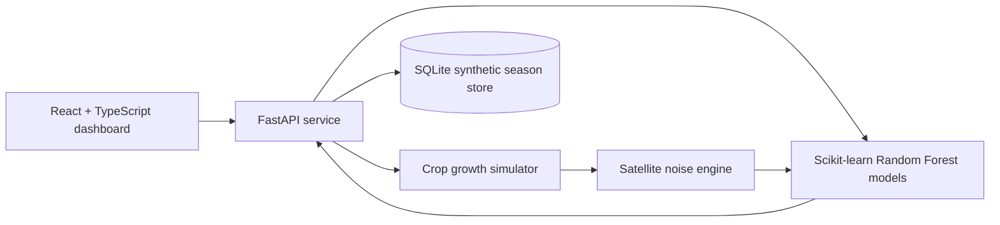

# Smart Satellite Crop Intelligence System

Synthetic satellite based crop classification, growth stage detection, and water deficit advisory for rice, wheat, cotton, and sugarcane.

> Data disclosure: every observation in this repository is synthetic and generated by the included simulator. No real satellite imagery, copyrighted datasets, field datasets, or external crop datasets are used. Literature is used only to choose realistic parameter ranges and relationships.

## One-command run

```bash
docker compose up --build
```

Open the dashboard at http://localhost:5173 and the API docs at http://localhost:8000/docs.

## Local development

```bash
cd backend
python -m venv .venv
. .venv/Scripts/activate
pip install -r requirements.txt
uvicorn app.main:app --reload
```

```bash
cd frontend
npm install
npm run dev
```

## What judges can demo

1. Generate a new synthetic season with a fresh random seed.
2. Increase cloud percentage and sensor noise.
3. Compare clean-ish vs noisy runs and watch classifier accuracy decrease.
4. Inspect NDVI, NDMI, and stress timelines.
5. Open confusion matrices and classification reports.
6. Review water advisory explanations with current NDMI, stress score, and recommendation.

## Architecture



## Repository structure

```text
frontend/      React TypeScript dashboard with Recharts and dark mode
backend/       FastAPI API, simulator, ML, advisory, SQLite persistence
models/        Model notes and generated artifact location
simulation/    Simulator design documentation
api/           API contract documentation
dashboard/     Dashboard feature notes
assets/        Project visual assets and design notes
docs/          Research summary, diagrams, and hackathon pitch
outputs/       Final deliverables such as the presentation deck
```

## Scientific basis used for simulation

| Topic | Implementation choice | Source basis |
| --- | --- | --- |
| Growth duration | Rice 90-150 d, wheat 120-150 d, cotton 180-195 d, sugarcane 270-365 d | FAO Irrigation Water Management, Table 6 |
| Growth stages | Initial, development, mid-season, late-season with crop-specific names | FAO Irrigation Water Management, Table 7 |
| Water need ranges | Rice 450-700 mm, wheat 450-650 mm, cotton 700-1300 mm, sugarcane 1500-2500 mm | FAO Irrigation Water Management, Table 14 |
| Kc logic | Water demand increases with canopy, peaks mid-season, declines near maturity | FAO crop coefficient method |
| NDVI behavior | Low early vegetation, green-up, high canopy, senescence/harvest decline | NASA Earth Observatory NDVI explanation |
| NDMI/NDWI logic | NIR-SWIR moisture index responds to canopy water content | Gao 1996 NDWI/NDMI concept |
| Satellite imperfections | Revisit cadence, cloud gaps, random/clustered missing data, Gaussian noise | ESA Sentinel-2 and USGS Landsat mission behavior |
| ML model | RandomForestClassifier for robust tabular time-series features | scikit-learn ensemble documentation |

## Simulator explanation

For each crop and plot, the simulator samples a planting date, duration, weather factor, seasonal water demand, and possible water stress event. It creates daily hidden `true_ndvi` and `true_ndmi` values with a phenological curve that rises, peaks, and declines. The satellite noise engine then samples only revisit days, applies configurable cloud gaps and clustered missing periods, and adds noise to produce `observed_ndvi` and `observed_ndmi`.

The machine-learning pipeline only receives observed features: `day_norm`, `observed_ndvi`, `observed_ndmi`, short-window slopes, and clear rows after cloud filtering. Clean hidden values remain in the simulator output for chart comparison and scientific transparency, not for model training.

## Accuracy

Accuracy is generated at runtime from the synthetic season and displayed in the dashboard. Expected behavior is high accuracy at low noise/cloud settings and lower accuracy when cloud percentage, revisit interval, and sensor noise are increased. This is intentional and supports live judging: the simulator makes the data harder instead of hiding uncertainty.

## Limitations

- This project does not estimate yield and must not be interpreted as a real farm advisory.
- NDVI and NDMI values are synthetic approximations, not measurements.
- Crop calendars are generalized from FAO ranges and do not represent a specific cultivar, soil, irrigation system, or region.
- Cloud contamination is simulated at time-series level, not with pixel-level radiative transfer.
- The advisory engine is rule-based and should be calibrated with field measurements before real use.

## Future work

- Add crop-region presets and cultivar-specific phenology.
- Add pixel grids and spatial texture simulation.
- Add SAR-style all-weather observations for cloudy periods.
- Add active learning and uncertainty explanations.
- Validate against permitted field experiments if a future competition allows real data.

## Hackathon pitch

Smart Satellite Crop Intelligence System gives judges a complete end-to-end remote-sensing AI workflow without violating the no-real-dataset rule. It simulates crop phenology, satellite imperfections, ML classification, growth-stage detection, and irrigation advice from first principles and published parameter ranges. The live demo proves scientific honesty: when observations get noisier, model confidence and accuracy decline.

## Research references

- FAO. Irrigation Water Management: Irrigation Water Needs. https://www.fao.org/4/s2022e/s2022e00.htm
- FAO. Crop evapotranspiration: Guidelines for computing crop water requirements, Irrigation and Drainage Paper 56. https://www.fao.org/4/x0490e/x0490e00.htm
- NASA Earth Observatory. Measuring Vegetation (NDVI & EVI). https://science.nasa.gov/earth/earth-observatory/measuring-vegetation-ndvi-evi/
- ESA. Sentinel-2 mission facts. https://www.esa.int/Applications/Observing_the_Earth/Copernicus/Sentinel-2
- Copernicus SentiWiki. Sentinel-2 mission and MSI details. https://sentiwiki.copernicus.eu/web/s2-mission
- USGS. Landsat Satellite Missions. https://www.usgs.gov/landsat-missions/landsat-satellite-missions
- Gao, B.-C. 1996. NDWI: A normalized difference water index for remote sensing of vegetation liquid water from space. Remote Sensing of Environment.
- scikit-learn. Ensemble methods and RandomForestClassifier documentation. https://scikit-learn.org/stable/modules/ensemble.html
