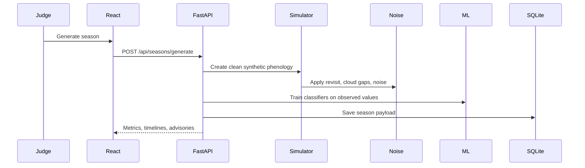
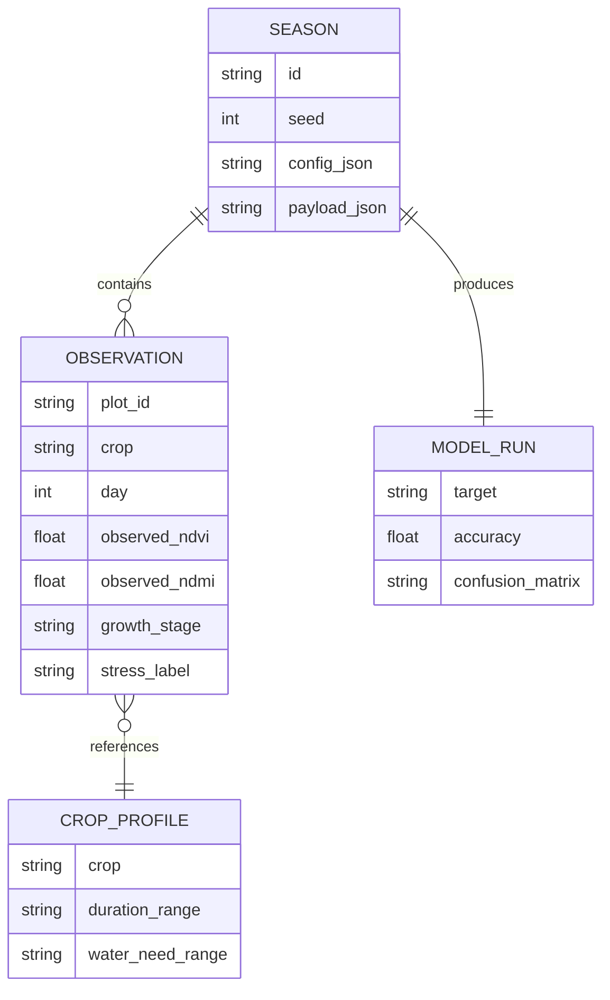

# Diagrams

## Workflow

```mermaid
sequenceDiagram
  participant Judge
  participant React
  participant FastAPI
  participant Simulator
  participant Noise
  participant ML
  participant SQLite
  Judge->>React: Generate season
  React->>FastAPI: POST /api/seasons/generate
  FastAPI->>Simulator: Create clean synthetic phenology
  Simulator->>Noise: Apply revisit, cloud gaps, noise
  FastAPI->>ML: Train classifiers on observed values
  FastAPI->>SQLite: Save season payload
  FastAPI-->>React: Metrics, timelines, advisories
```

## ER diagram

```mermaid
erDiagram
  SEASON ||--o{ OBSERVATION : contains
  SEASON ||--|| MODEL_RUN : produces
  OBSERVATION }o--|| CROP_PROFILE : references
  SEASON {
    string id
    int seed
    string config_json
    string payload_json
  }
  OBSERVATION {
    string plot_id
    string crop
    int day
    float observed_ndvi
    float observed_ndmi
    string growth_stage
    string stress_label
  }
  MODEL_RUN {
    string target
    float accuracy
    string confusion_matrix
  }
  CROP_PROFILE {
    string crop
    string duration_range
    string water_need_range
  }
```
